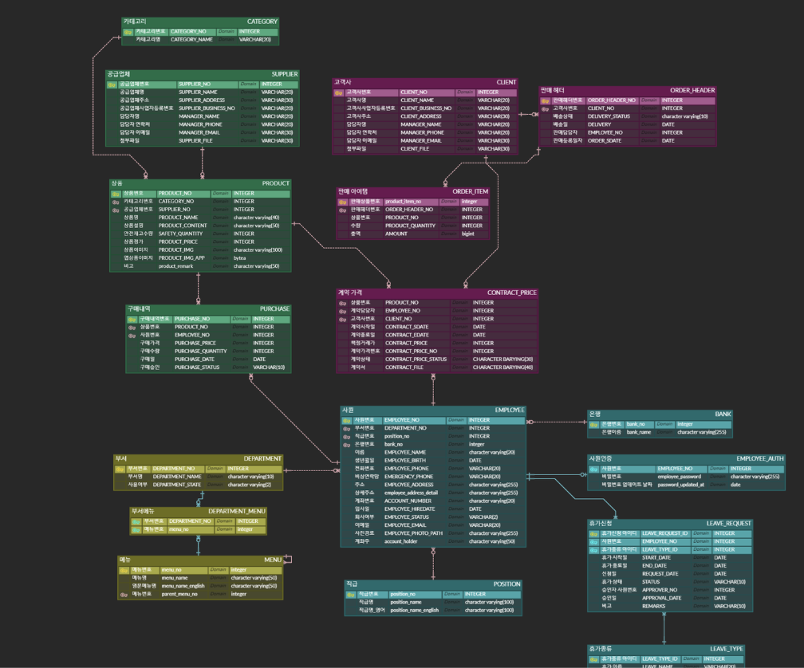
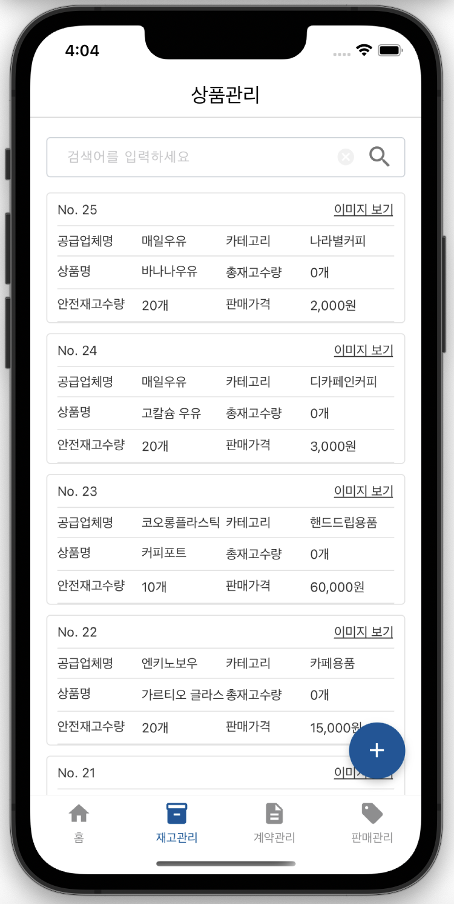
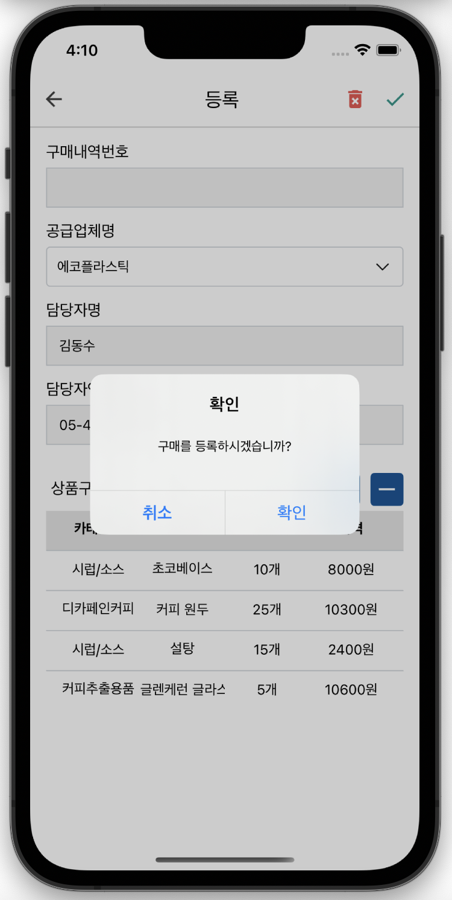
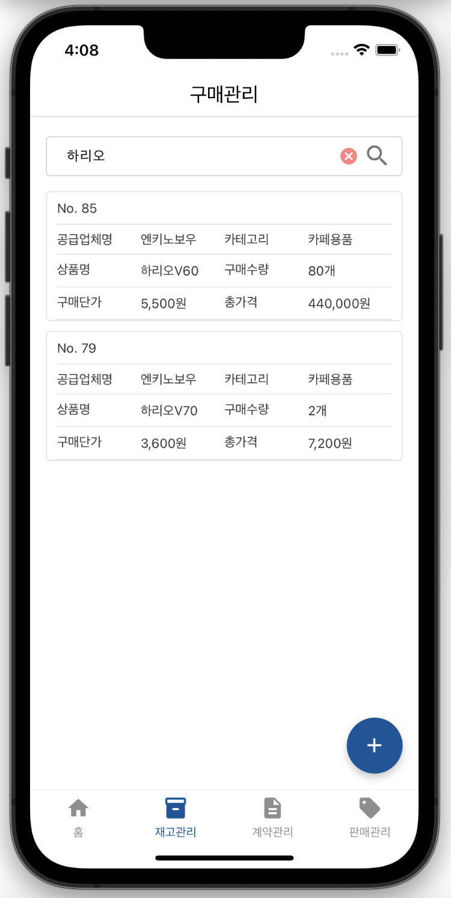
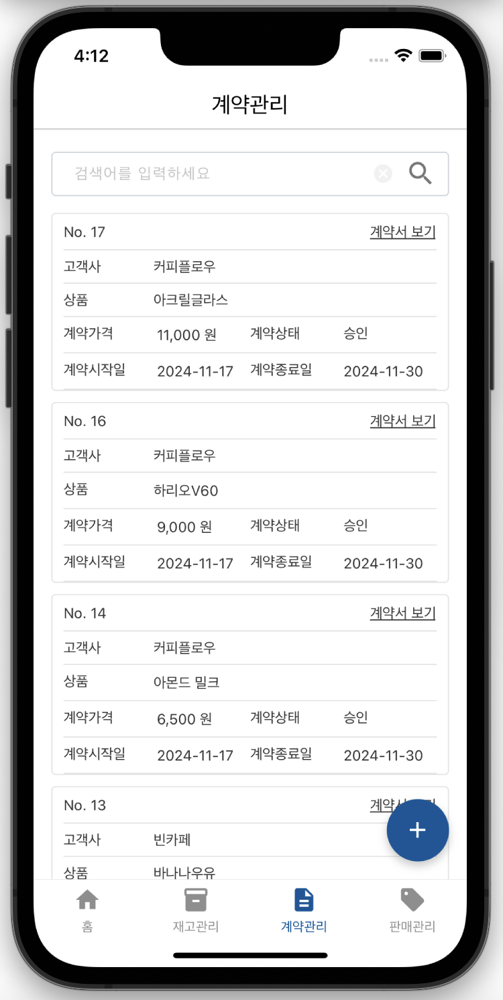
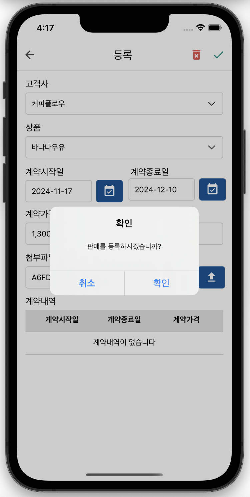
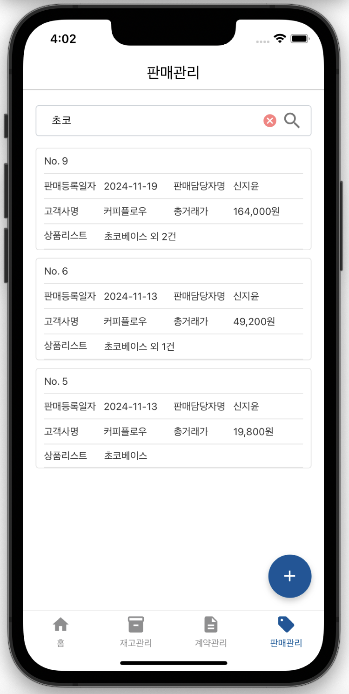

# 커피원두 및 부자재 납품업체 영업ERP 서비스 (앱 App)

## 목차
1. [프로젝트 소개](#oneshotapp-프로젝트-소개)
2. [개발 일정](#개발-일정)
3. [팀원 구성](#팀원-구성)
4. [개발환경 및 기술스택](#개발환경-및-기술스택)
6. [프로젝트 설계](#프로젝트-설계)
7. [화면UI](#화면-ui)
8. [프로젝트 발표 ppt](#프로젝트-발표-ppt)

 

## OneshotApp 프로젝트 소개

- **Oneshot 웹사이트 프로젝트**에서 시작된 영업 ERP 시스템을 애플리케이션화하여, 업무 효율성을 극대화하고자 진행된 프로젝트입니다.

 

- 본사 입장에서 **공급업체로부터 상품을 구매**하고, 이를 **고객사에 판매**하는 시스템을 운영합니다.

 

## 개발 일정
- **개발 기간** : 2024/10/15 ~ 11/15

 

## 팀원 구성

| **김수현** | **홍나린** | **신지윤** |
| :------: | :------: | :------: |
| [   @shyunu](https://github.com/shyunu) | [   @Hong-NaRin](https://github.com/Hong-NaRin) | [   @jishin14](https://github.com/jishin14) |
| 역할 | 역할 | 역할 |
|  |  |  |

 
  
## 개발환경 및 기술스택

| 항목 | 내용 |
|---|---|
| **프로그래밍 언어** | Java 11 |
| **프론트엔드** | React 18.1.0, React-native 0.70.15 |
| **패키지 상태관리** | Yarn
| **프레임워크** | Spring Boot 2.7.18 |
| **빌드 도구** | gradle-8.1 |
| **데이터베이스(DB)** | PostgreSQL 16.3 (AWS RDS) |
| **데이터베이스 연동** | MyBatis |
| **개발 도구(IDE)** | IntelliJ IDEA, Visual Studio Code, XCode, Android Studio |

 

## 프로젝트 설계
### 🔗 ERD CLOUD

### 🔗 DataFlow

 

## 화면 UI

## 1. 앱 로딩 / 로그인 / 메인 홈

### 1-1. 앱 로딩 시 대기 화면
📍 **앱 로딩 시 대기 화면입니다.**  
초기 앱 진입 시 나타나는 대기 화면입니다. 로딩 3초 후에 로그인 화면으로 전환합니다.

  

 

### 1-2. 로그인 및 홈화면
📍 **로그인/메인홈 화면입니다.**  
로그인 과정을 통해 계정을 확인하여 메인 홈 화면으로 이동합니다. 금일 계약과 판매의 등록 현황이 실시간으로 나타나며 분기별 매출액을 조회하고 목표 판매량을 변경하여 데이터를 확인할 수 있습니다.
이와 같이 목표판매량을 1500만원에서 3500만원으로 변경하면 변경값에 대한 정보를 확인할 수 있습니다.

  
  
  
  

## 2. 상품관리
📍 **상품관리 화면**  
이와 같이 상품을 조회 가능하며 새로운 상품을 등록할 수 있습니다. 원하는 상품을 검색하여 필터링할 수 있고 등록 시 첨부된 상품의 이미지도 상세하게 확인 가능합니다.

  
  
  
  

## 3. 구매관리
📍 **구매관리 화면**  
구매한 상품을 조회 가능하며 상품을 구매 등록할 수 있습니다. 성공적으로 구매가 이루어지면 원하는 상품을 검색하여 필터링할 수 있습니다.

  
  
  
  

## 4. 계약관리
📍 **계약관리 화면**  
고객사와의 계약을 조회 및 등록할 수 있습니다. 계약사, 계약시작일, 계약종료일 등 양식에 맞게 작성하면 계약이 정상 등록됩니다. 계약 등록 시 첨부한 계약서 또한 확인할 수 있습니다.

  
  
  
  

## 5. 판매관리
📍 **판매관리 화면**  
고객사와의 계약을 통해 결정된 계약가격으로 여러 상품의 판매 등록이 가능하며 판매 상세조회 또한 제공하고 있습니다. 원하는 항목에 대하여 검색 기능도 제공합니다.

  
  
  

  
  

## 프로젝트 발표 ppt
### [OneshotApp-ppt.pdf](https://github.com/user-attachments/files/18032625/OneshotApp-ppt.pdf)
