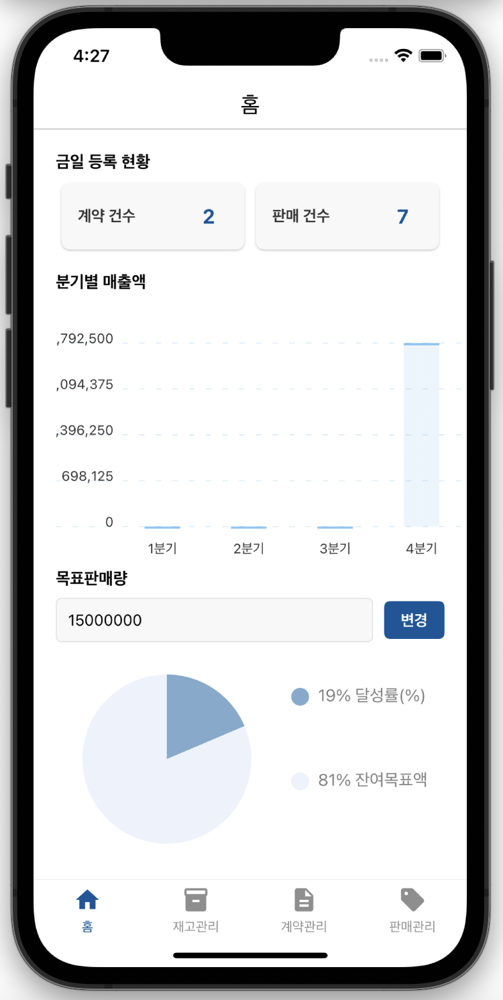

# 커피원두 및 부자재 납품업체 영업ERP 서비스 (앱 App)

- **개발 기간** : 2024/10/15 ~ 11/15

 
  
## 개발 환경 및 기술 스택

| 항목 | 내용 |
|---|---|
| **프로그래밍 언어** | Java 11 |
| **프론트엔드** | React 18.3.1, React-native 0.70.15 |
| **프레임워크** | Spring Boot 2.7.18 |
| **보안** | Spring Security |
| **빌드 도구** | gradle-8.1 |
| **데이터베이스(DB)** | PostgreSQL 16.3 (AWS RDS) |
| **데이터베이스 연동** | MyBatis |
| **개발 도구(IDE)** | IntelliJ IDEA, Visual Studio Code |

 

## 팀원 구성

| **김수현** | **홍나린** | **신지윤** |
| :------: | :------: | :------: |
| [   @shyunu](https://github.com/shyunu) | [   @Hong-NaRin](https://github.com/Hong-NaRin) | [   @jishin14](https://github.com/jishin14) |

 

# 프로젝트 구현 화면

## 1. 앱 로딩 / 로그인 / 메인 홈

### 1-1. 앱 로딩 시 대기 화면
<table>
  <tr>
    <td></td>
  </tr>
</table>

📍 **앱 로딩 시 대기 화면입니다.**
초기 앱 진입 시 나타나는 대기 화면입니다. 로딩 3초 후에 로그인 화면으로 전환합니다.

### 1-2. 로그인 성공 화면
<table>
  <tr>
    <td></td>
    <td></td>
    <td></td>
    <td></td>
  </tr>
</table>

📍 **로그인/메인홈 화면입니다.**
로그인 과정을 통해 계정을 확인하여 메인 홈 화면으로 이동합니다. 금일 계약과 판매의 등록 현황이 실시간으로 나타나며 분기별 매출액을 조회하고 목표 판매량을 변경하여 데이터를 확인할 수 있습니다. 이와 같이 목표판매량을 1500만원에서 3500만원으롤 변경하면 변경값에 대한 정보를 확인할 수 있습니다.

 

### 1-2. 메인 홈 화면

  

📍 **Oneshot ERP 메인 화면**  
연차(휴가제도)를 사용한 직원의 일정, 분기별 매출액, 목표판매량 도달률, 사원수, 사내 규정 등의 정보를 확인할 수 있습니다.

## 2. 인사관리 - 부서관리

### 2-1. 부서 등록 화면

  

📍 **부서 등록 화면**  
부서명을 입력하고 사용 가능 메뉴를 선택하면 해당 메뉴에 대해서만 사용 권한이 부여됩니다.

 
